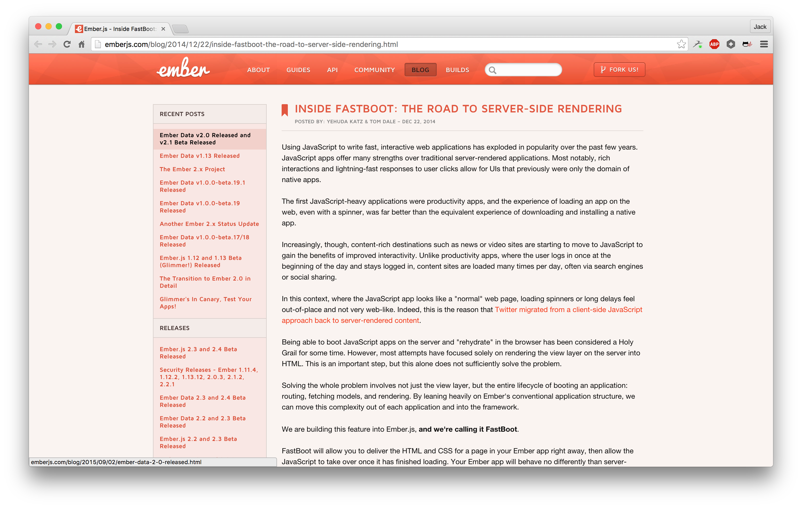

# Universal React

---

# @Jack_Franklin, Pusher

--- 


---


---

# Why?

---


[Source: GDS Blog, 2013](https://gds.blog.gov.uk/2013/10/21/how-many-people-are-missing-out-on-javascript-enhancement/)

---

"Surprisingly, the proportion of people that have explicitly disabled JavaScript or use a browser that doesn't support JavaScript, __only makes up a small slice of people that don't run JavaScript__."

---

"Progressive enhancement has never been about users who've turned JavaScript off, or least it wasn't for me."

[Jake Archibald, "Progressive Enhancement Still Important"](https://jakearchibald.com/2013/progressive-enhancement-still-important/)

---

## Everyone has JS, right?

- On a train / in a tunnel / etc
- HTTP request hangs
- Firewalls
- ISP is interfering
- A browser addon is messing with you
- Your CDN is down

[Stuart Langridge's Flowchart](http://kryogenix.org/code/browser/everyonehasjs.html)

---

# Time and a place

---

A standard React app:

```javascript
class MyApp extends React.Component {
  render() { ...  }
}

ReactDOM.render(
  document.getElementById('app'),
  <MyApp />
)
```

---

Server side:

```javascript
class MyApp extends React.Component {
  render() { ...  }
}

ReactDOM.renderToString(
  document.getElementById('app'),
  <MyApp />
)
```

---

# React is a great fit

---



---

# Demo!

(Contains ES6)

---
