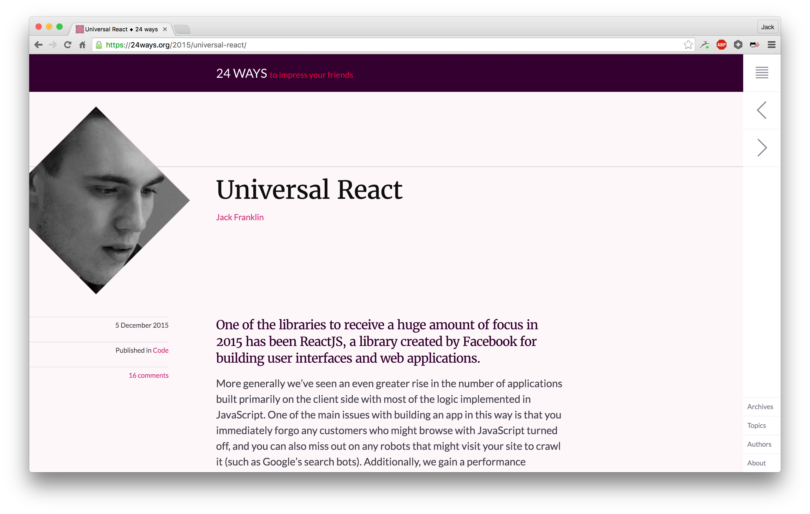
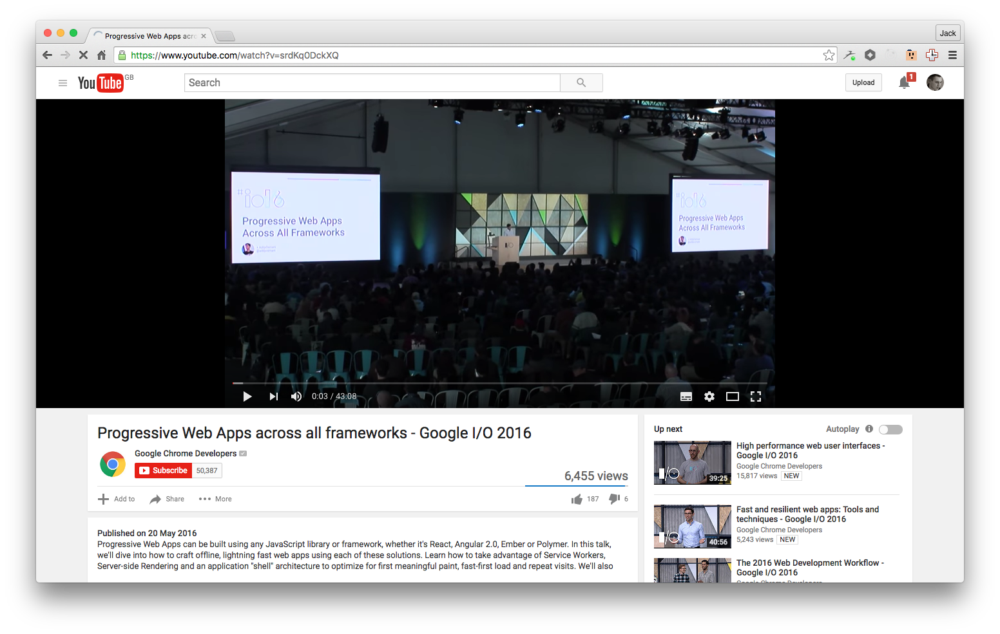
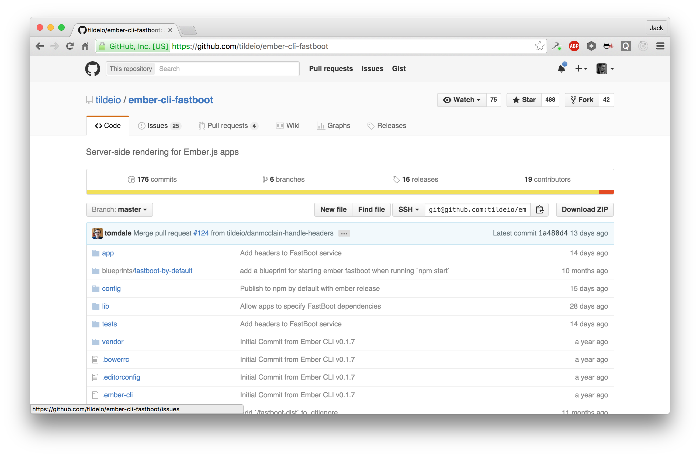
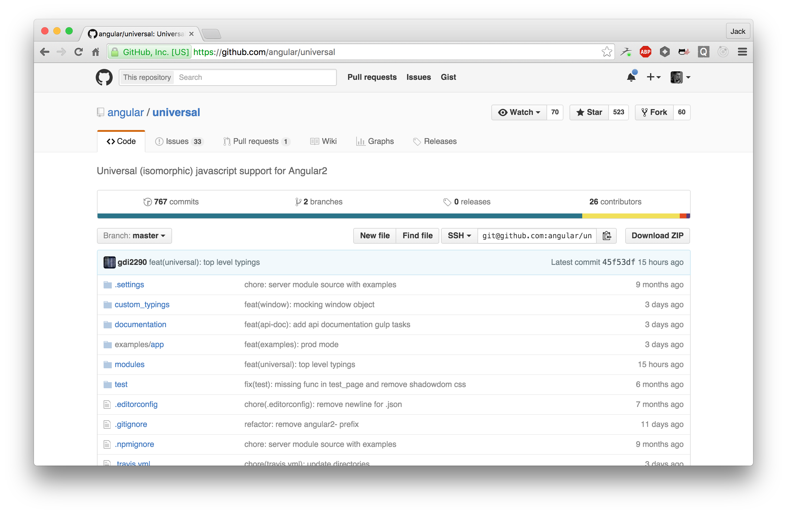

# Universal JavaScript

---

# @Jack_Franklin, Pusher

--- 


---


---


---



---

# Why?

---


[Source: GDS Blog, 2013](https://gds.blog.gov.uk/2013/10/21/how-many-people-are-missing-out-on-javascript-enhancement/)

---

"Surprisingly, the proportion of people that have explicitly disabled JavaScript or use a browser that doesn't support JavaScript, __only makes up a small slice of people that don't run JavaScript__."

---

"Progressive enhancement has never been about users who've turned JavaScript off, or least it wasn't for me."

[Jake Archibald, "Progressive Enhancement Still Important"](https://jakearchibald.com/2013/progressive-enhancement-still-important/)

---

## Everyone has JS, right?

- On a train / in a tunnel / etc
- HTTP request hangs
- Firewalls
- ISP is interfering
- A browser addon is messing with you
- Your CDN is down

[Stuart Langridge's Flowchart](http://kryogenix.org/code/browser/everyonehasjs.html)

---



---

# Think about if this is right for you!

---

# Cutting Edge!

We're really still at the early stages of figuring out how this stuff works.

Some of the code shown here isn't the easiest, or the APIs aren't that straight forward.

This will change as we learn more. Don't expect this to be 100% smooth!

---

# React paved the way

---



---



---

Code and demos: https://github.com/jackfranklin/universal-react-talk/tree/fel

---

A standard React app:

```javascript
class MyApp extends React.Component {
  render() { ...  }
}

ReactDOM.render(
  <MyApp />,
  document.getElementById('app')
)
```

---

Server side:

```javascript
class MyApp extends React.Component {
  render() { ...  }
}

ReactDOM.renderToString(<MyApp />)
```

---

# Tada!

---

```js
// some imports left out to save space
import React from 'react';
import MyApp from './component';
import { renderToString } from 'react-dom/server';

const app = express();

app.get('*', (req, res) => {
  const markup = renderToString(<MyApp />);
  res.render('index', { markup });
});

```

---

# renderToString
When your HTML is going to be picked up by React on the client

# renderToStaticMarkup
When your HTML is never going to be edited by client-side React

---

```html
<!DOCTYPE html>
<html>
  <head>
    <title>My App</title>
  </head>

  <body>
    <p data-reactid=".nbhys48o3k" data-react-checksum="-1312485142">Hello from React</p>
  </body>
</html>
```

---

# Going Client side

- Shared set of components that are environment agnostic
- A server rendering step (like we just saw)
- A client rendering step
- A bundler to generate our client side JavaScript

---

# Agnostic Components

---

# Webpack

---

# Rendering on the Client

---

Updating our server template.

```html
<body>
  <!-- markup will be replaced with React generated HTML -->
  <div id="app"><%- markup %></div>
  <!-- build.js is our client side bundle -->
  <script src="build.js"></script>
</body>
```

---

Creating __client.js__:

```javascript
import React from 'react';
import ReactDOM from 'react-dom';

import MyApp from './component';

ReactDOM.render(
  <MyApp />,
  document.getElementById('app')
);
```

---

# Same Components on client and server

---

```
npm install --save-dev webpack \
  babel-loader \
  babel-preset-es2015 \
  babel-preset-react \
  babel-yet-another-thing-lol-jk
```

---

Create __.babelrc__

```json
{
  "presets": ["es2015", "react"]
}
```

---

Create __webpack.config.js__

```javascript
var path = require('path');
module.exports = {
  entry: path.join(process.cwd(), 'client.js'),
  output: {
    path: './public/',
    filename: 'build.js'
  },
  module: {
    loaders: [
      {
        test: /.js$/,
        exclude: /node_modules/,
        loader: 'babel'
      }
    ]
  }
}
```

---

Run `webpack`:

(PS: in production we'd minify, etc!)

```
> webpack
Hash: 78c865d5593fe910f823
Version: webpack 1.12.12
Time: 4948ms
   Asset    Size  Chunks             Chunk Names
   build.js  690 kB       0  [emitted]  main
       + 160 hidden modules
```

(Tip: `webpack -w` for continuous rebuilds)

---

# An interactive component

```javascript
export default class MyApp extends React.Component {
  constructor() {
    super();
    this.state = { count: 0 };
  }

  onClick() {
    this.setState({ count: this.state.count + 1 });
  }

  render() {
    return (
      <div>
        <button onClick={this.onClick.bind(this)}>Click Me</button>
        <p>Count: { this.state.count }</p>
      </div>
    );
  }
}
```

---


---

# A read-only experience is way better than no experience.

---

# This isn't about giving every user 100% functionality every time.

---

# Routing

---


# react-router

The defacto, practically standard routing solution for React.

https://github.com/rackt/react-router

---

First we need some more components, starting with __components/app.js__:

```js
import React from 'react';

export default class AppComponent extends React.Component {
  render() {
    return (
      <div>
        <h2>My web 2.0 app</h2>
        { this.props.children }
      </div>
    );
  }
}
```

`this.props.children` are the nested routes.

---

And then __components/index.js__:

```js
import React from 'react';

export default class IndexComponent extends React.Component {
  render() {
    return (
      <div>
        <p>This is the index page</p>
      </div>
    );
  }
}
```

---

Define our routes:

```javascript
import { Route } from 'react-router';
import React from 'react';

import AppComponent from './components/app';
import IndexComponent from './components/index';

export const routes = (
  <Route path="" component={AppComponent}>
    <Route path="/" component={IndexComponent} />
  </Route>
);
```

---

Match against the URL on the server.

Gets a bit hairy, stick with me!

[React Router server side guide](https://github.com/rackt/react-router/blob/master/docs/guides/advanced/ServerRendering.md)

---

```javascript
// our newly defined routes
import { routes } from './routes';

// match is responsible for matching routes against a URL
// RouterContext renders the components in the matched routes
import { match, RouterContext } from 'react-router';
```
---

```javascript

app.get('*', (req, res) => {
  match({ routes, location: req.url }, (error, redirectLocation, renderProps) => {
    if (error) {
      res.status(500).send(error.message)
    } else if (redirectLocation) {
      res.redirect(302, redirectLocation.pathname + redirectLocation.search)
    } else if (renderProps) {
      res.render('index', {
        markup: renderToString(<RouterContext {...renderProps} />)
      });
    } else {
      res.status(404).send('Not found')
    }
  })
});
```

---

# Let's break that down...

---

```javascript
// take our app's routes, and the URL of the request
match({ routes, location: req.url },
  (error, redirectLocation, renderProps) => {
  // error: given if something went wrong matching a route

  // redirectLocation: returned if the URL matches a redirect

  // renderProps: given if a route was matched and we can render
  ...
});
```

---

```javascript
if (error) {
  // if there was an error, 500 with the error message

  // you might show a custom error HTML page here

  res.status(500).send(error.message)

} else if (redirectLocation) {
  ...
}
```

---
```javascript
  ...
} else if (redirectLocation) {
  // if we need to redirect, redirect to the new URL

  res.redirect(302, redirectLocation.pathname + redirectLocation.search)

} else if (renderProps) {
  ...
}
```

---

```javascript
  ...
} else if (renderProps) {
  // if we have renderProps that means we have a match and can render
  res.render('index', {
    // RouterContext is React Router's wrapper around our app

    // and renderProps contains all the info
    // React Router needs to render our app
    markup: renderToString(<RouterContext {...renderProps} />)
  });
} else {
  ...
}
```

---

```javascript
} else {
  // if we get here, it's not an error, redirect or match
  // hence, 404!
  res.status(404).send('Not found')
}
```

---


---

Let's add an about page!

---

__components/about.js__:

```javascript
import React from 'react';

export default class AboutComponent extends React.Component {
  render() {
    return <p>Rockstar developer</p>;
  }
}
```
---

__routes.js__:

```javascript
import AppComponent from './components/app';
import IndexComponent from './components/index';
import AboutComponent from './components/about';
import React from 'react';
import { Route } from 'react-router';


export const routes = (
  <Route path="" component={AppComponent}>
    <Route path="/" component={IndexComponent} />
    <Route path="/about" component={AboutComponent} />
  </Route>
);
```

---

And some links...

```javascript
...
render() {
  return (
    <div>
      <h2>My web 2.0 app</h2>
      <Link to="/">Home</Link>
      <Link to="/about">About</Link>
      { this.props.children }
    </div>
  );
}
...
```

---

With no client side bundle, this works perfectly:


---

Updating the client side:

```javascript
import React from 'react';
import ReactDOM from 'react-dom';

import { Router, browserHistory } from 'react-router';
import { routes } from './routes';

ReactDOM.render(
  <Router routes={routes} history={browserHistory} />,
  document.getElementById('app')
)
```

And then rerun `webpack`.

---


---

# Dealing with Data on the server and client

---

# (Caveat: this area is still WIP)

Lots of unknowns!

---

1. We want to be able to fetch data on the server and/or on the client.
2. If the data is loaded on the server and rendered to the client, we ideally want to avoid making the request again.

---

# [React Resolver](https://github.com/ericclemmons/react-resolver)

---


__code/with-react-resolver__ has an example.

```js
class IndexComponent extends React.Component {
  render() {
    return (
      <div>
        <p>This is the index page</p>
        <p>My github repo count: { this.props.github.public_repos }</p>
      </div>
    );
  }
}

export default resolve('github', (props) => {
  return fetch('https://api.github.com/users/jackfranklin').then((data) => {
    return data.json();
  });
})(IndexComponent);
```

---

- Update the server side rendering to include `window.__REACT_RESOLVER_PAYLOAD__`.
- Update the client side rendering to use React Resolver.
- All data is resolved on the server, rendered and then used to populate data on the client.

---


---

This area is still being figured out - more solutions will definitely come!

---

# Code and Demos

[These slides and all the demos are on GitHub](https://github.com/jackfranklin/universal-react-talk).

__jackfranklin/universal-react-talk__

Please send me questions: @Jack_Franklin or jack@pusher.com.

---

# Universal JavaScript is here to stay.

The techniques, libraries and approaches will change over time.

There's plenty to figure out in this space!

Long term I expect frameworks to do more, and it become even easier for developers to take advantage.

---

# Server side by default?

---

# Further Reading

- [Universal React on 24ways](https://24ways.org/2015/universal-react/)
- [How we built the new gocardless.com](https://gocardless.com/blog/how-we-built-the-new-gocardless.com/)
- [GoCardless.com repo](https://github.com/gocardless/splash-pages)
- [Universal React Example app](https://github.com/jackfranklin/universal-react-example)

---

# If you dig React

I can make you dig it more! Day long React workshops in London:

- [16 March](http://www.whiteoctoberevents.co.uk/event/reactjs-workshop-march-16/)
- [10 June](http://www.whiteoctoberevents.co.uk/event/reactjs-workshop-june-16/)

---

# Thanks! @Jack_Franklin

javascriptplayground.com

http://speakerdeck.com/jackfranklin

jack@pusher.com
